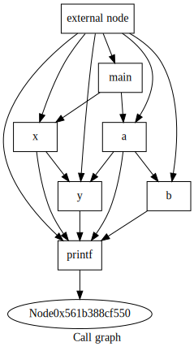
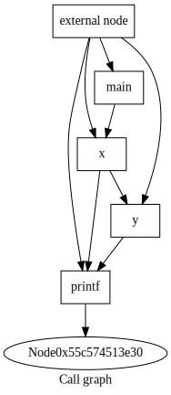

# APEX - Active code Path EXtractor

APEX is a tool that can extract active code path from the C program source code
and recompile this path into new, standalone executable.


### Getting started

In order to run APEX, you need to have llvm installed:
- https://llvm.org/docs/GettingStarted.html
- https://releases.llvm.org/3.8.0/docs/CMake.html


### How to run APEX

Input C source code is located in the [test.c](c-code/test.c). <br>
Source and target functions defining start and end of the active code path can
be specified in the [apex.h](apex/apex.h).

After providing input, run `make run`. Check `apex/build` for output.


### How it works

Let's say we have C source file [test.c](c-code/test.c) and we want to
extract active path between functions `main` and `y` (we specify these inputs
according to the instructions above).

After running `make run`, APEX:
- uses llvm and translates `test.c` into IR (intermediate representation)
- creates call graph from the IR
- finds some active code path from source (`main`) to target (`y`)
- removes functions that are not on the active code path

To run extracted active code path, type `lli apex/build/bytecode_from_input_basic_opts_and_apex.bc`
(see [build_and_run.sh](build_and_run.sh) script for more info).

Image on the left represents call graph before we run APEX, while image on the
right shows how the call graph looks after APEX transformed IR. <br>

 


### Current limitations:

Since APEX is under development, there are currently some serious limitations:

```
- supports only one compilation module
- handles only void returning functions on the active path
- does not handle external libraries
- (probably tons more that I don't know about)
```

[TODO](TODO.md) | [DOC](DOC.md)
